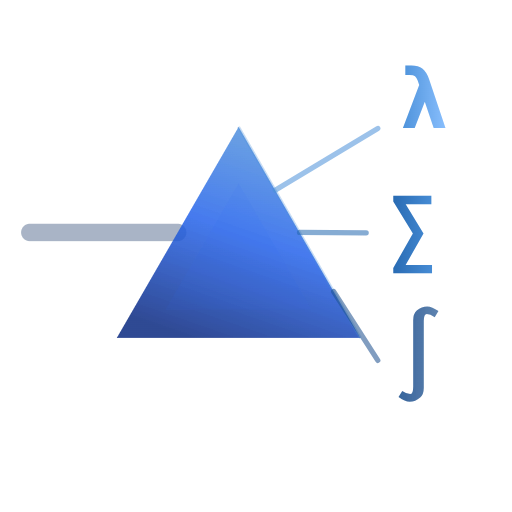
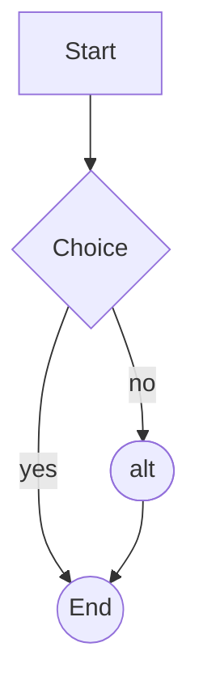

<p align="center">
  
</p>

<h1 align="center">innomd — Terminal Markdown Viewer with LaTeX Math Support</h1>

<p align="center">
  <em>Render Markdown files with real LaTeX math formulas, beautiful tables,
  and syntax-highlighted code — directly in your terminal.</em>
</p>

<p align="center">
  <a href="#installation">Install</a> ·
  <a href="#usage">Usage</a> ·
  <a href="#features">Features</a> ·
  <a href="#comparison">vs glow / mdcat / bat</a> ·
  <a href="#faq">FAQ</a> ·
  <a href="#license">License</a>
</p>

<p align="center">
  <a href="https://github.com/Innomatica-GmbH/innomd/actions/workflows/tests.yml"></a>
  <a href="https://pypi.org/project/innomd/"></a>
  
  
  
  <a href="https://innomatica.de"></a>
</p>

---

**innomd** is a command-line Markdown viewer for Linux and macOS that
renders LaTeX math (`$$…$$`, `$…$`, `\[…\]`, `\(…\)`) as clean Unicode,
so scientific notes, physics formulas, and technical documentation read
naturally in any terminal. Most CLI Markdown viewers — glow, mdcat, bat —
print `$$\lambda = \frac{b}{T}$$` as raw LaTeX source. `innomd` shows it
as a proper formula:

```
$$\lambda_{\text{peak}} = \frac{b}{T} \quad \text{with } b = 2{,}898 \times 10^{-3} \text{ m·K}$$
```

renders as

```
▌ λₚₑₐₖ = b/T   with b = 2,898 × 10⁻³ m·K
```

---

## Who is this for?

- Scientists, engineers, and students who keep notes in Markdown with
  embedded LaTeX math and want to read them in a terminal instead of a
  browser.
- Data scientists and ML engineers who want to skim `.ipynb` notebooks
  without starting Jupyter.
- Developers writing technical documentation (physics, ML, signal
  processing) who already use tools like `glow`, `mdcat`, or `bat` and
  miss proper math rendering.
- Anyone who prefers a fast, keyboard-driven Markdown preview over
  spinning up VS Code or a PDF viewer.

## Features

- **LaTeX math to Unicode**: `$$…$$`, `$…$`, `\[…\]`, `\(…\)`
  - Greek letters (`\lambda`, `\varepsilon`, `\sigma`, `\pi`, …)
  - Operators (`\cdot`, `\times`, `\nabla`, `\int`, `\sum`, `\propto`, `\approx`, …)
  - Fractions (`\frac`, `\dfrac`, `\tfrac`), roots (`\sqrt`, `\sqrt[n]{x}`)
  - Sub- and superscripts, including nested braces
  - `\text{…}`, `\vec`, `\hat`, `\bar`, `\dot`
  - Blackboard bold (`\mathbb{R}`, `\mathbb{N}`, `\mathbb{Z}`, …)
- **Jupyter notebook support** — pass any `.ipynb` file and it's rendered as
  Markdown: cells, code with syntax highlighting, stream and execution
  outputs.
- **Live reload** — `innomd --watch file.md` opens an interactive viewer
  that re-renders on every save and lets you scroll, search, and jump
  between matches — ideal for writing notes in one pane and previewing
  in another.
- **Mermaid and PlantUML diagrams** — ` ```mermaid `, ` ```plantuml `,
  ` ```puml `, and ` ```uml ` blocks all render as Unicode/ASCII diagrams
  directly in the terminal. Auto-detection picks the right adapter based
  on the source content (`@startuml` / `flowchart` / `sequenceDiagram`
  / etc.):
  - **Flowcharts** with 14 node shapes (rect, round, stadium, diamond,
    hexagon, circle, parallelograms, trapezoids, double circle, …)
  - **Sequence diagrams** with lifelines, sync/async arrows, self-loops,
    `loop`/`alt`/`opt` block markers, `Note left/right/over of X`
    annotations, and `activate`/`deactivate` lifeline activations
  - **Class diagrams** with class boxes (name + member compartments) and
    UML edges (inheritance △, composition ◆, aggregation ◇, association ▶)
  - **Gantt charts** with date axis, task bars by state (done/active/
    future), and dependency resolution (`after X` / `[X] starts at [Y]'s end`)
  - **PlantUML C4** architecture diagrams: `Person()`/`System()`/
    `Container()`/`ContainerDb()`/`Rel()`/`Boundary { … }` macros render
    into a flowchart-style graph
  - **PlantUML Activity** diagrams: `start`/`stop`/`:label;` actions,
    `if (cond) then (yes)…else (no)…endif` decisions, `while`/`repeat`
    loops
- **Theme presets** — 9 built-in color themes: `default`, `nord`, `dracula`,
  `gruvbox`, `solarized-dark`, `solarized-light`, `tokyonight`, `github`,
  `mono`. List with `innomd --list-themes`.
- **Rich Markdown rendering** via [rich](https://github.com/Textualize/rich):
  headings, lists, blockquotes, links, syntax-highlighted code blocks.
- **Beautiful tables** with rounded Unicode borders and column alignment.
- **Subtle horizontal rules** (`---` renders as centered `· · ·`).
- **Pager integration** (`less -R`) with automatic TTY detection.
- **Code-block safe** — math inside fenced code blocks is never substituted.
- **Pure Python** — `rich` plus `grandalf` (a small layout library); no
  Node, no Graphviz binary, no Go toolchain. `pipx install innomd` is
  the only step you need, including for diagram rendering.

## Installation

Requires Python 3.9+. The recommended way is [pipx](https://pipx.pypa.io/),
which installs `innomd` into its own virtual environment and exposes the
command on your `$PATH`:

```bash
pipx install innomd
```

On Ubuntu/Debian, if `pipx` is not yet available:

```bash
sudo apt install -y pipx && pipx ensurepath
```

Why not plain `pip`? Modern Linux distributions (Debian, Ubuntu,
Fedora, …) ship Python as PEP 668 *externally managed* and will reject
`sudo pip install`. Either use `pipx` (recommended) or install into a
virtual environment:

```bash
python3 -m venv ~/.venvs/innomd
~/.venvs/innomd/bin/pip install innomd
ln -s ~/.venvs/innomd/bin/innomd ~/.local/bin/innomd
```

To install from source (e.g. a specific commit or for development):

```bash
git clone https://github.com/Innomatica-GmbH/innomd.git
cd innomd
pipx install .           # or: pip install -e .   (editable, inside a venv)
```

### Windows (via WSL)

`innomd` depends on POSIX terminal APIs (`termios`, `tty`) for its
interactive watch mode, so it is developed and tested for Linux and
macOS. On Windows, use it inside the **Windows Subsystem for Linux**:

```powershell
wsl --install -d Ubuntu
```

Then inside your Ubuntu shell:

```bash
sudo apt install -y pipx && pipx ensurepath
pipx install innomd
```

Open a WSL tab in Windows Terminal — everything including watch mode,
mouse scrolling, and search works as on Linux.

## Usage

```bash
innomd README.md                  # render a file (uses pager on TTY)
innomd analysis.ipynb             # render a Jupyter notebook
innomd --watch notes.md           # live-reload preview
innomd -t dracula file.md         # use a preset theme
innomd -t nord -c dracula file.md # preset + override code theme
innomd --list-themes              # list available presets
cat notes.md | innomd             # pipe from stdin
innomd -P file.md                 # no pager
innomd -w 100 file.md             # fixed width
innomd -r file.md                 # raw preprocessed markdown
```

### Options

| Flag                    | Description                                   |
|-------------------------|-----------------------------------------------|
| `-P`, `--no-pager`      | Print directly, no pager                      |
| `-r`, `--raw`           | Output preprocessed markdown, no render       |
| `-w N`, `--width N`     | Force terminal width in columns               |
| `-t`, `--theme`         | Preset theme (see `--list-themes`)            |
| `-c`, `--code-theme`    | Override Pygments code theme only             |
| `-W`, `--watch`         | Live-reload: re-render on file change         |
| `--no-diagrams`         | Disable mermaid diagram rendering             |
| `--diagrams-ascii`      | Render diagrams with ASCII glyphs only        |
| `--diagrams-wide`       | Render wide diagrams at natural width (use with pager + `less -S`) |
| `--list-themes`         | List available preset themes                  |

### Watch mode

`innomd --watch file.md` opens a scrollable viewer that reloads on file
changes while keeping your scroll position. It's a small `less`-like
pager, no external dependencies.

| Key | Action |
|-----|--------|
| `j`, `↓` | line down |
| `k`, `↑` | line up |
| `space`, `PgDn` | page down |
| `b`, `PgUp` | page up |
| `g`, `Home` | jump to top |
| `G`, `End` | jump to bottom |
| `/pattern` + `Enter` | case-insensitive regex search |
| `n` / `N` | next / previous match |
| `:q` + `Enter` *or* `q` | quit |
| `:reload` *or* `:r` | force re-render |
| `Esc` | cancel `/` or `:` prompt |
| mouse wheel | scroll (3 lines per tick) |

Mouse scrolling uses SGR reporting (xterm 1006). Inside tmux, add
`set -g mouse on` to your `~/.tmux.conf`. When mouse reporting is
active, hold `Shift` to select text with the mouse — standard
xterm behaviour shared with `less`, `htop`, `vim`.

### Mermaid and PlantUML diagrams

Fenced ` ```mermaid ` and ` ```plantuml ` (also `puml`, `uml`) blocks
are rendered inline as terminal-friendly diagrams. innomd auto-detects
both the source format and the diagram type from the block content,
then dispatches to the appropriate adapter and renderer.

PlantUML and mermaid share the same internal representation (IRs) and
the same renderers — only the parsing differs. So a sequence diagram
written in PlantUML produces identical visual output to one written in
mermaid.

#### Flowcharts (`graph` / `flowchart`)



Supported syntax:

- Headers: `graph TD|LR|BT|RL`, `flowchart TD|LR|BT|RL`, with optional
  YAML frontmatter (`---\ntitle: …\n---`)
- Node shapes:
  - `A[rect]` — sharp box
  - `B(round)` — rounded corners
  - `C([stadium])` — pill with parens on sides
  - `D{decision}` — heavy-line box; for short labels (≤6 chars) a true
    rhombus with `╱╲` slopes
  - `E{{hexagon}}` — double-line border
  - `F((circle))` — indented top/bottom with curved sides
  - `G[/parallelogram/]`, `H[\parallel-alt\]` — true leaning shapes
  - `I[/trapezoid\]`, `J[\trap-inv/]` — bottom-/top-wider trapezoids
  - `K[(cylinder)]`, `L[[subroutine]]`, `M>asymmetric]`, `N(((stop)))`
  - All accept quoted labels: `A["with spaces & punct"]`
- Edges: `-->` (arrow), `---` (no arrow), `-.->` (dashed), `==>` (thick)
- Edge labels: `A -- text --> B` and `A -->|text| B`

#### Sequence diagrams (`sequenceDiagram`)

Lifelines (vertical bars) per participant, horizontal arrows per message
in time order. Sync (`->>`), async (`-->>`), self-messages (rendered as
small loops on the lifeline). `loop`/`alt`/`opt`/`par` blocks render as
gestrichelt label markers. Participant boxes are repeated at the bottom
so identities stay visible on long diagrams.

#### Class diagrams (`classDiagram`)

Class boxes show the name and member compartments (fields and methods).
UML edge decorations: `△` inheritance (at parent), `◆` composition,
`◇` aggregation, `▶` association, dashed line for dependency, double
arrow for bidirectional. Disconnected components are shelf-packed
horizontally instead of stacked vertically, so a diagram with many
small class pairs reads compactly.

#### Gantt charts (`gantt`)

Date axis with year/month-day ticks, task bars styled by state:
`█` done, `▓` active, `░` future. Tasks support absolute dates and
durations (`Nd`/`Nw`), plus `after <id>` dependencies that resolve to
absolute start dates automatically. Sections are rendered as labeled
groups.

#### PlantUML notes

PlantUML support covers the same diagram families as mermaid —
sequence, class, gantt — using PlantUML's `@startuml … @enduml` (or
`@startgantt … @endgantt`) wrapper syntax:

- **Sequence**: `participant X`, `actor X`, `X -> Y : text` (sync),
  `X --> Y : text` (async/dashed), self-messages, `loop`/`alt`/`opt`
  block markers, direction modifiers in arrows (`-down->`, `-[#red]->`),
  trailing stereotypes (`<<Person>>`), `Note left/right/over of X: …`
  annotations, and `activate X` / `deactivate X` lifeline activations.
- **Class**: same edge connectors as mermaid (`<|--`, `*--`, `o--`,
  `..>`), plus block-style member declaration:
  ```
  class Animal {
    +String name
    +makeSound()
  }
  ```
- **Gantt**: `[Task] lasts N days`, `[Task] starts <date>`,
  `[Task] starts at [Other]'s end`, `[Task] is done`,
  `[Task] is X% completed`, `-- Section --` dividers.
- **C4 architecture**: the [C4-PlantUML](https://github.com/plantuml-stdlib/C4-PlantUML)
  macro vocabulary — `Person()`, `System()`, `Container()`, `ContainerDb()`,
  `Component()`, `Rel()`, `BiRel()`, `System_Boundary { … }` — is
  rendered into a flowchart-style graph with appropriate node shapes
  (round for people, rect for systems/containers, cylinder for `*Db`
  variants, stadium for `*Queue`).
- **Component primitives**: bare `rectangle`, `frame`, `interface`,
  `component`, `database`, `queue`, `actor`, `cloud`, `node`, `card`,
  `folder`, `file` declarations are accepted as nodes, with arrows
  between them as edges.
- **Activity**: `start` / `stop`, `:Action;` action nodes, `if (cond)
  then (yes) … else (no) … endif` decision branches with `elseif`
  chains, `while (cond) … endwhile` loops, `repeat … repeat while
  (cond)` do-while loops. Renders into a top-down flowchart.

#### Scope & limitations

**This is not a full mermaid or PlantUML implementation.** innomd
parses the *common subset* used in technical documentation and renders
the rest as plain code blocks. The fallback never crashes, never warns
loudly — unsupported syntax simply shows up as the original source.

What's *not* supported and currently falls back to a code block:

- Mermaid: gitGraph, mindmap, journey, ER, state machines (all types),
  pie, quadrant, timeline, requirement, sankey, mind map, kanban —
  none of these have a renderer yet.
- Mermaid: the modern `A@{ shape: cyl, label: "…" }` shape syntax,
  styling directives (`style A fill:…`, `classDef`), subgraph
  containers, click handlers.
- PlantUML: nested `partition` blocks and `fork`/`fork again`/`end fork`
  parallel splits — flattened to a sequential flow at parse time.
- PlantUML: deployment, object, state, timing, network, archimate,
  Wireframe (Salt), ER, EBNF, regex, JSON/YAML, MindMap, Work
  Breakdown, Gantt with resource allocation.
- PlantUML: `!include` / `!includeurl` directives are recognized and
  skipped, but the *contents* they would have pulled in (custom
  shapes, sprites, themes) are not resolved. The C4-PlantUML stdlib
  macros are special-cased so they don't *need* the include to work.
- Both: anything that depends on an HTTP fetch (themes, includes,
  remote sprites) is silently dropped — innomd is offline-only.

Layout for flowcharts and class/C4 diagrams uses
[grandalf](https://pypi.org/project/grandalf/), a pure-Python Sugiyama
layered-graph library — no external Graphviz binary required. Sequence
and gantt diagrams have their own dedicated renderers because they are
not graphs (lifelines + time order; bars on a calendar axis).

Use `--diagrams-ascii` if your terminal lacks Unicode box-drawing
support, or `--no-diagrams` to skip rendering entirely and show every
diagram source as a normal code block.

If a diagram is too wide for the terminal it falls back to the source
by default. Pass `--diagrams-wide` to render it at its natural width
anyway — best paired with the built-in pager (default on TTY), which
sets `LESS=-R -S` so long diagram lines scroll horizontally with the
arrow keys instead of wrapping. Without a pager, lines may wrap.

## Comparison

How `innomd` stacks up against other terminal Markdown viewers:

| Tool       | LaTeX math | Jupyter `.ipynb` | Live reload | Mermaid | PlantUML | Tables | Code highlighting | Images | Language |
|------------|:----------:|:----------------:|:-----------:|:-------:|:--------:|:------:|:-----------------:|:------:|:--------:|
| **innomd** | ✅ (Unicode) | ✅ | ✅ | ✅ (flowchart, sequence, class, gantt) | ✅ (sequence, class, gantt, **C4**, activity) | ✅ | ✅ | — | Python |
| glow       | ❌ | ❌ | ❌ | ❌ | ❌ | ✅ | ✅ | — | Go |
| mdcat      | ❌ | ❌ | ❌ | ❌ | ❌ | ✅ | ✅ | ✅ (Kitty/iTerm2) | Rust |
| bat        | ❌ | ❌ | ❌ | ❌ | ❌ | ❌ | ✅ (syntax only) | — | Rust |
| frogmouth  | ❌ | ❌ | ❌ | ❌ | ❌ | ✅ | ✅ | — | Python |

If you don't write formulas, use `glow` or `mdcat` — they're excellent.
If you do, this tool exists because nothing else did the job in the terminal.

## FAQ

**Does `innomd` render math like a LaTeX compiler?**
No. It substitutes LaTeX commands with Unicode glyphs. Matrices, large
alignments, and exotic notation will not look like PDF output. Physics
formulas, basic algebra, and common engineering notation render cleanly.

**Why Python and not Rust/Go?**
Because `rich` already solves 90 % of the Markdown-in-terminal problem,
and math preprocessing is a small layer on top. One dependency, one file,
no cross-compilation headaches.

**Why not just use a browser or VS Code preview?**
For quick notes, cat-ing a `.md` in the terminal is faster than opening
a GUI. This tool is for people who already live in tmux.

**Does it work on Windows?**
Not natively — `innomd` uses POSIX terminal APIs (`termios`/`tty`) for
its interactive watch mode. Use it via **WSL** (see the install
section). Inside WSL everything works identically to Linux.

## Limitations

`innomd` approximates LaTeX with Unicode — it will not render arbitrary math
to pixel perfection. Terminals can't. For papers, export to PDF with `pandoc`.
Notation that survives well: physics formulas, basic algebra, common operators.
Notation that degrades: matrices, commutative diagrams, large alignments.

## Development

Run the test suite (53 unit + end-to-end tests):

```bash
python3 -m unittest discover -s tests -t tests -v
```

CI runs the suite on Python 3.9 – 3.12 against every push and pull request.

## Contributing

Issues and pull requests welcome. Keep changes small and focused; there are
no runtime dependencies besides `rich`.

## License

[MIT](LICENSE) © 2026 Innomatica GmbH

Maintainer: Ivan Maradzhiyski &lt;ivan.maradzhiyski@innomatica.de&gt;

---

<p align="center">
  Built by <a href="https://innomatica.de">Innomatica GmbH</a> —
  software engineering for DACH and beyond.
</p>
